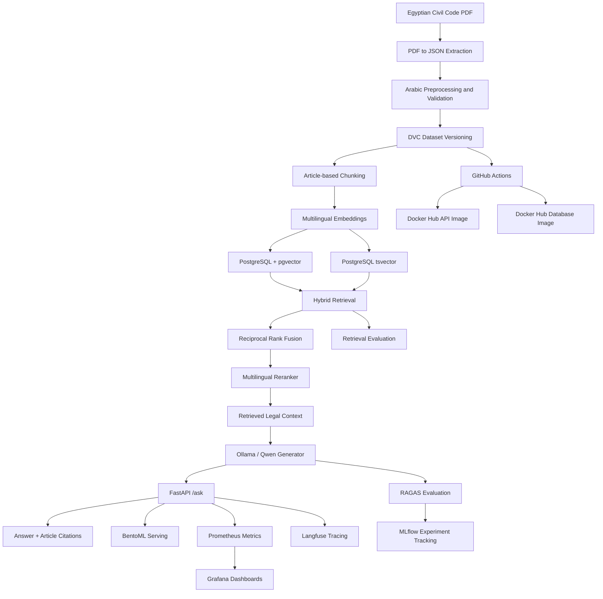

# Arabic Legal RAG — Egyptian Civil Code

An MLOps-oriented Retrieval-Augmented Generation (RAG) system for the Egyptian Civil Code, focusing on Arabic legal text processing, hybrid retrieval, reproducible data pipelines, experiment tracking, evaluation, and containerized deployment.

## 1. Quick Start — Run with Docker Hub

The application uses prebuilt Docker images published on Docker Hub.

### Prerequisites

- [Docker Desktop](https://www.docker.com/products/docker-desktop/)
- [Git](https://git-scm.com/downloads)
- [Ollama](https://ollama.com/download)

### Step 1 — Clone the repository

```powershell
git clone https://github.com/shimaa83/rag-legal.git
cd rag-legal
git checkout legal-v1
```

### Step 2 — Configure the environment

Create a `.env` file in the project root:

```dotenv
POSTGRES_PASSWORD=choose_a_secure_password
GENERATOR_MODEL=qwen2.5:3b
```

Install and download the local generation model:

```powershell
ollama pull qwen2.5:3b
```

Ensure Ollama is running and accessible from the API container at `http://host.docker.internal:11434`.

### Step 3 — Pull and run

The Docker Compose file must reference the published Docker Hub images:

```yaml
services:
  postgres:
    image: shimaa83/legal-rag-db:latest

  api:
    image: shimaa83/legal-rag-api:latest
```

Keep the complete service configuration, including ports, database environment variables, health checks, volumes, and dependencies.

Pull the images and start the application:

```powershell
docker compose pull
docker compose up -d
docker compose ps
```

Access the services:

- **FastAPI documentation:** http://localhost:8000/docs
- **Prometheus:** http://localhost:9093
- **Grafana:** http://localhost:3003

The API depends on the PostgreSQL database and the locally running Ollama model.

To stop the application:

```powershell
docker compose down
```

## 2. Final Architecture Diagram



The diagram presents the overall project architecture, including implemented components and planned extensions. Individual serving and monitoring integrations are tracked separately in the project status.

## 3. Project Structure

The project follows a Python package layout under `src/legal_rag/`, with dependencies and package configuration defined in `pyproject.toml`.

```text
legal_RAG/
├── .github/
│   └── workflows/
│       └── ci.yml
├── data/
│   ├── raw/
│   │   ├── egyptian_civil_code.pdf
│   │   └── civil_code.json
│   └── processed/
│       └── civil_code.json
├── docker/
│   └── restore-dump.sh
├── monitoring/
│   └── prometheus.yml
├── reports/
├── sql/
│   └── schema.sql
├── src/
│   └── legal_rag/
│       ├── config.py
│       ├── pdf_to_json.py
│       ├── data_preprocessing.py
│       ├── chunking.py
│       ├── embeddings.py
│       ├── database.py
│       ├── ingestion.py
│       ├── retrieval.py
│       ├── reranker.py
│       ├── rag.py
│       ├── api.py
│       ├── mlflow_tracking.py
│       ├── ragas_evaluation.py
│       └── service.py
├── tests/
├── dvc.yaml
├── dvc.lock
├── Dockerfile.api
├── Dockerfile.db
├── docker-compose.yml
├── pyproject.toml
├── uv.lock
└── README.md
```

Install the project locally in editable mode:

```bash
pip install -e .
```

Alternatively, install the locked development environment with `uv`:

```bash
uv sync --frozen
```

## 4. Data Extraction and Validation

The Egyptian Civil Code PDF is converted into structured JSON, with one record per article.

Each record contains fields such as:

- `article_number`
- `book`, `chapter`, and `section`
- `topic`
- `ar_text` and `text_en`
- `is_repealed`
- `source_page`
- `citation`

Validation covers article numbering, Arabic text quality, and repealed-article flags. Article numbers are normalized to integers, Arabic text is spot-checked, and repealed articles are explicitly flagged.

The current processed corpus contains approximately 1,149 article records.

## 5. DVC Data Versioning and Reproducibility

DVC tracks the source PDF and derived JSON datasets, while Git tracks the code and pipeline configuration.

The pipeline consists of:

1. PDF-to-JSON conversion.
2. Arabic preprocessing and validation.

Download tracked data:

```bash
uv run dvc pull
```

Reproduce the pipeline:

```bash
uv run dvc repro
```

Inspect pipeline status:

```bash
uv run dvc status
```

The DVC remote is hosted on DagsHub. Authentication credentials should be configured locally or through GitHub Actions Secrets.

The reproducibility goal is to regenerate the processed corpus from versioned source documents and pipeline code.


## Incremental Legal Article Ingestion
The `reindex_new_article.py` script validates and preprocesses a single new legal article, generates chunks and multilingual embeddings, and submits them to PostgreSQL without reprocessing the entire corpus.
**Validation status:** Database insertion, duplicate handling, and retrieval of a newly added article are pending verification.

**Steps:** Validate article → Preprocess text → Generate chunks → Create embeddings → Insert into PostgreSQL → Verify retrieval.

## 6. Ingestion Pipeline

The ingestion pipeline transforms structured legal articles into searchable representations:

1. Load processed JSON.
2. Create article-based chunks.
3. Generate multilingual embeddings.
4. Store chunks, metadata, and vectors in PostgreSQL with pgvector.
5. Maintain PostgreSQL full-text search representations for keyword retrieval.

The current article-based strategy produced 1,149 chunks, with no article splits in the recorded corpus.

## 7. PostgreSQL Hybrid Retrieval

The retrieval system combines two complementary search methods.

**Vector search**

Uses multilingual embeddings from `intfloat/multilingual-e5-small` and pgvector similarity search.

**Keyword search**

Uses PostgreSQL `tsvector` and full-text search to retrieve results based on legal terms.

**Reciprocal Rank Fusion (RRF)**

Combines the ranked results from both retrieval methods.

The best recorded retrieval configuration uses:

| Parameter | Value |
|---|---:|
| RRF constant (`rrf_k`) | 20 |
| Candidate count | 20 |
| Vector weight | 1.0 |
| Keyword weight | 0.25 |
| Final retrieval count | 10 |

On the recorded 30-question retrieval evaluation, this configuration achieved Recall@5 of 1.000 and MRR of 0.889.

These results apply to the recorded evaluation set and do not guarantee the same performance on unseen questions.

## 8. Reranking and Generation

The pipeline applies a multilingual reranker to improve the relevance of retrieved legal passages.

Recorded components include:

- **Embedding model:** `intfloat/multilingual-e5-small`
- **Reranker:** `Horizon-Labs/multilingual-reranker-small`
- **Generator:** `qwen2.5:3b` through Ollama

The generation prompt is designed to constrain answers to the retrieved legal context, reduce unsupported claims, and return relevant article citations.

The generator should acknowledge insufficient evidence instead of inventing legal provisions.

## 9. FastAPI Interface

The API exposes two main endpoints.

### `POST /ask`

Request:

```json
{
  "question": "ما هو سن الرشد في القانون المدني المصري؟"
}
```

Response:

```json
{
  "answer": "The generated legal answer.",
  "sources": ["Article citation"]
}
```

The response contract is:

`{question: str} → {answer: str, sources: list[str]}`

The `sources` field contains article citations rather than internal chunk IDs.

Pydantic validation rejects empty questions and returns HTTP 422 for invalid request data.

### `GET /health`

Returns service health and the number of documents indexed in the processed corpus:

```json
{
  "status": "healthy",
  "documents_indexed": 1149
}
```

The document count reflects the processed corpus count exposed by the health endpoint; it should not be interpreted as a live database row count.

## 10. Docker Deployment

The project provides separate Docker images for the API and database:

- `shimaa83/legal-rag-api`
- `shimaa83/legal-rag-db`

The API image packages the application and its runtime dependencies. The database image is designed to initialize PostgreSQL and restore the prepared database dump.

The database must contain the required legal chunks, metadata, and embeddings for retrieval to work.

Docker Compose coordinates PostgreSQL, the API, and the optional monitoring services. The API uses the database service name for database connectivity and connects to Ollama on the host.

Published images should be used for normal deployment instead of rebuilding the images on each machine.

## 11. MLflow Experiment Tracking

MLflow records experiments and aggregate metrics to support reproducible comparisons.

Tracked configuration parameters include:

- `chunk_size`
- `overlap`
- `embedding_model`
- Retrieval parameters
- Generator configuration
- Dataset or DVC revision where available

Experiment results are stored in the configured MLflow tracking server. DagsHub is used for remote experiment tracking.

Chunking and retrieval experiments should be compared under consistent evaluation conditions. The selected configuration should be registered in the MLflow Model Registry when the registration workflow is available and verified.

Screenshots and exported comparison results belong in `reports/`.

## 12. RAGAS Evaluation

The RAG pipeline was evaluated using **RAGAS**, with evaluation metrics tracked in MLflow through DagsHub.

**Hardware and evaluation limitations:**
- **vLLM was not available for this setup** because the project was running on CPU-only hardware. Therefore, the local Qwen model was used through Ollama as the generator.
- The planned evaluation on **50 questions could not be completed** because the Gemini API free-tier quota was exhausted during the evaluation process.
- The following results are from a smaller evaluation set of **5 questions**. They demonstrate promising performance, but a larger evaluation is required to establish more reliable and representative results.

#### Evaluation Metrics

| Metric | Score |
|---|---:|
| Faithfulness | **1.0000 (100%)** |
| Answer Relevancy | **0.9449 (94.49%)** |
| Context Precision | **1.0000 (approximately 100%)** |
| Context Recall | **1.0000 (100%)** |
| Article Recall@5 | **1.0000 (100%)** |
| Article Precision@5 | **0.2000 (20%)** |
| Sample Answer Relevancy | **0.9250 (92.50%)** |

**Evaluation configuration:**

| Parameter | Value |
|---|---|
| Generator Model | `qwen2.5:3b` |
| Judge Provider | Gemini |
| Judge Model | `gemini-3.5-flash-lite` |
| Embedding Model | `intfloat/multilingual-e5-small` |
| Retrieval Strategy | Hybrid Search |
| Fusion Method | Weighted Reciprocal Rank Fusion (RRF) |
| `top_k` | 5 |
| `candidate_k` | 20 |
| Number of Questions | 5 |
| Prompt Hash | `326fdb8d` |

**Observations:**

- The system achieved **100% faithfulness** on the five evaluated questions, indicating that the generated answers were fully supported by the retrieved context according to the RAGAS judge.
- Answer relevancy reached approximately **94.49%**, while context precision and recall both reached approximately **100%**.
- Article Recall@5 reached **100%**, meaning the expected relevant article was retrieved within the top five results for the evaluated questions.
- Article Precision@5 was **20%**, indicating that there is still room to improve the proportion of retrieved articles that are relevant.

**Next steps:** Expand the evaluation dataset to 50 questions, subject to judge-model availability or quota limits, and reassess the metrics on a larger and more diverse set of legal questions. The current results should be interpreted as an encouraging preliminary evaluation rather than a definitive measure of overall system performance.

[View the RAGAS evaluation run in DagsHub MLflow](https://dagshub.com/shimaa83/rag-legal.mlflow/#/experiments/7/runs/1f47476a269040288e60baec8f7200a1/model-metrics).
## 13. BentoML Serving and Performance Testing

The project includes a BentoML serving component for exposing the RAG pipeline through a service endpoint. The locally tested BentoML interface has been available at:

http://localhost:3002/

The API and BentoML are separate serving paths and should be documented with their own startup commands and ports.

Locust is used for load testing. A previously recorded test completed seven requests with zero failures; median latency was approximately 108 seconds and average latency approximately 99.6 seconds.

This is an initial performance baseline, not a 50-concurrent-user result.

A repeatable 50-user Locust report should be generated and saved under `reports/` before claiming that the required load-test target has been completed.

Example command for the FastAPI service on port 8000:

```powershell
New-Item -ItemType Directory -Force reports

uv run locust -f locustfile.py `
  --headless `
  -H http://localhost:8000 `
  -u 50 `
  -r 5 `
  -t 5m `
  --html reports/locust_50_users.html `
  --csv reports/locust_50_users
```

Run the test only after confirming that a single `/ask` request succeeds. Long-running LLM requests can significantly affect load-test latency.

## 14. Langfuse and Observability

Langfuse is used for tracing and prompt observability in the RAG pipeline.

The intended observability workflow includes:

- A trace for each `/ask` request.
- Spans for retrieval and generation.
- Prompt and model configuration tracking.
- Association of evaluation results with traces where supported.

Prometheus and Grafana provide the monitoring foundation. Prometheus configuration is stored in `monitoring/prometheus.yml`, and Grafana is exposed on port 3003.

Further observability goals include token-usage metrics, cost estimates, latency and error dashboards, and alerts when faithfulness falls below 0.80.

## 15. CI/CD with GitHub Actions

The GitHub Actions workflow runs on pushes to `main` and `legal-v1`, as well as pull requests.

The workflow includes:

1. Dependency installation.
2. DVC dataset preparation when credentials are available.
3. Database schema initialization.
4. Lint and format checks.
5. Python compilation.
6. Automated tests.
7. Docker image build and publication after the test job succeeds.

The publication workflow uses GitHub Actions Secrets for external credentials.

The Docker publication target is Docker Hub, using the repositories `shimaa83/legal-rag-api` and `shimaa83/legal-rag-db`. The workflow and Compose file should use the same registry and tag conventions.

Automated RAGAS faithfulness gating at the required 20-question threshold is a planned CI enhancement.

## 16. Re-indexing and Corpus Updates

The planned batch re-indexing workflow supports adding new source documents and updating the vector store reproducibly.

The target workflow is:

1. Add and validate a new source document.
2. Convert it to the structured schema.
3. Update the DVC-tracked dataset.
4. Run preprocessing and validation.
5. Rebuild embeddings and refresh the database index.
6. Evaluate retrieval and generation quality.
7. Record the dataset revision and results.

A tested new-document re-indexing demonstration and a documented canary rollout configuration are planned extensions.

## 17. Additional Quality and Optimization Roadmap

The following items are future extensions rather than claims of completed implementation:

- **vLLM serving:** evaluate vLLM as an alternative generation backend where the available hardware supports it.
- **Streaming responses:** return generated tokens progressively to clients.
- **Quantization:** evaluate AWQ 4-bit quantization and document model weights and hardware requirements.
- **Quality comparison:** compare RAGAS metrics before and after quantization, targeting a faithfulness drop of no more than 0.03.
- **Latency comparison:** document generation latency before and after quantization.
- **Embedding drift:** track cosine similarity between incoming query embeddings and a baseline.
- **PII guardrails:** implement and validate personally identifiable information detection on `/ask` responses.
- **Automated alerts:** notify maintainers when faithfulness drops below 0.80.
- **Canary rollout:** document a safe deployment and rollback procedure.

These extensions depend on implementation time, evaluation data, and available hardware. Large-model serving and quantization experiments may require additional GPU resources.

## 18. Testing and Reproducibility

Run unit tests:

```bash
uv run pytest -q
```

Compile the package:

```bash
uv run python -m compileall -q src
```

Check code style:

```bash
uvx ruff check src tests
uvx ruff format --check src tests
```

Reproduce the data pipeline:

```bash
uv run dvc repro
```

Test the API health endpoint and a single `/ask` request before running performance tests.

Store reproducible evaluation outputs, Locust reports, MLflow experiment screenshots, and configuration comparisons in `reports/`.

## 20. Project Status

| Component | Status |
|---|---|
| Python package layout and configuration | Implemented |
| PDF-to-JSON extraction | Implemented |
| Arabic preprocessing and article validation | Implemented |
| DVC pipeline and DagsHub remote | Implemented |
| PostgreSQL with pgvector | Implemented |
| Hybrid retrieval and RRF | Implemented and evaluated |
| Multilingual reranker | Integrated |
| Ollama-based RAG generation | Implemented |
| FastAPI `/ask` and `/health` | Implemented |
| MLflow experiment tracking | Integrated |
| Initial RAGAS evaluation | Completed|
| BentoML service | Implemented and locally tested |
| Langfuse integration | Integrated; expand trace-level evaluation as needed |
| Docker API and database images | Published to Docker Hub |
| Docker Compose deployment | Configured; validate on a clean machine |
| Prometheus and Grafana | Configuration provided |
| 50-user Locust report |  done |
| 20-question automated RAGAS CI gate | done |
| RAGAS evaluation on at least 50 questions | not suitable to use due to gimini qute |
| Canary rollout configuration | Planned |
| vLLM and streaming | not suitable to my machine |
| AWQ-4bit comparison | Hardware-dependent planned extension |
| Embedding drift, PII guardrails, and faithfulness alerts | Planned |

## 21. Project Goals

The long-term goal is to build a reproducible, observable, and evaluable Arabic legal RAG system that combines versioned data, hybrid retrieval, grounded generation, experiment tracking, automated quality checks, and containerized deployment.

The project distinguishes measured results from future targets so that improvements can be validated through repeatable experiments.

## License

Add the applicable license and source-document attribution according to the project's distribution requirements.
